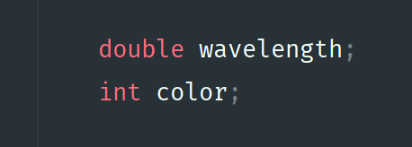
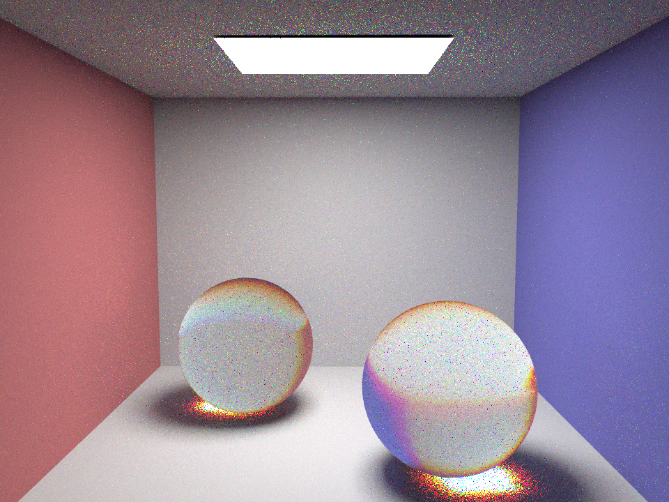
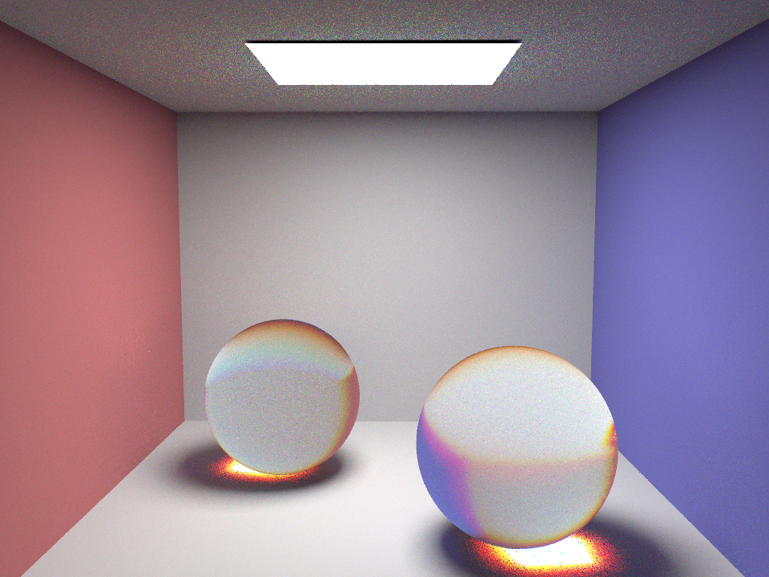
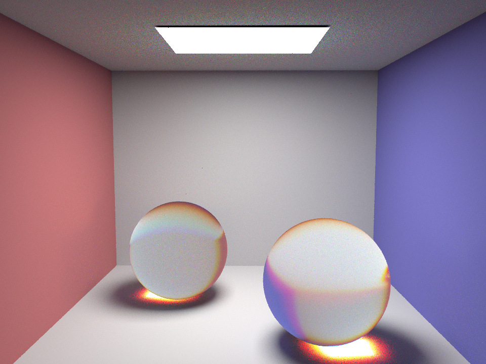
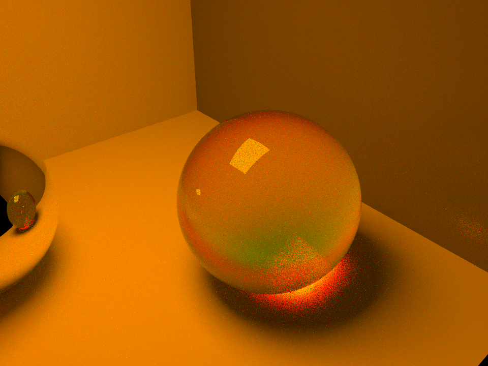
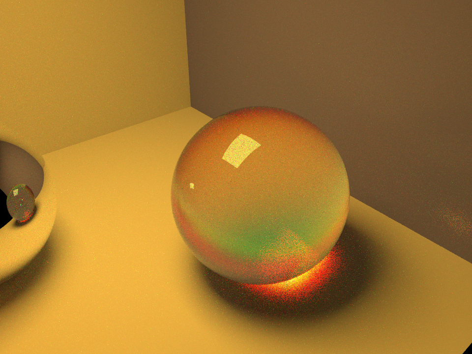
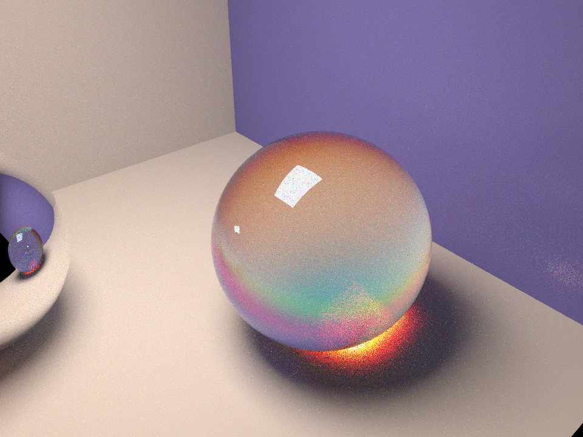
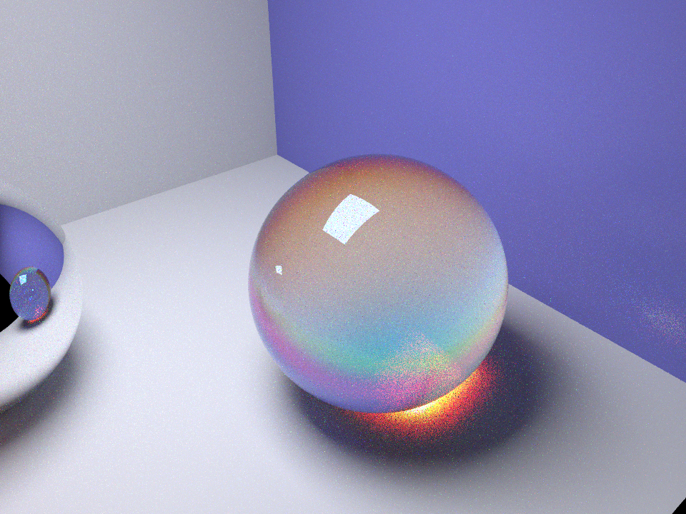
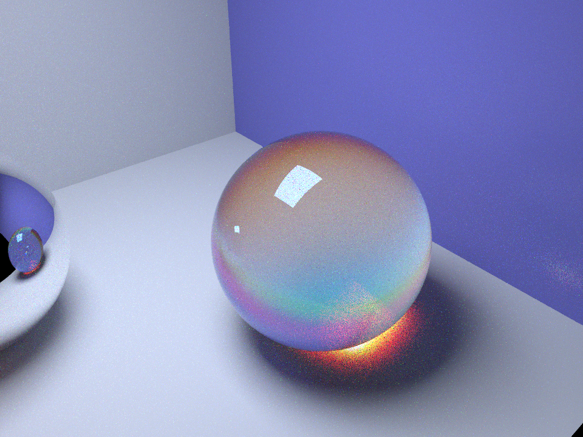

# Realize Spectral Ray Tracing

Haopeng Chen			120090645

## Overview

The objective of this final project is to expand on the knowledge gained in the course and implement advanced features in computer graphics. For this project, I have chosen to focus on Topic 3, which involves implementing Spectral Ray Tracing. Ray tracing is an important technique in computer graphics as it addresses the limitations of rasterization. While ray tracing is slower, it can produce high-quality and realistic images. Typically, ray tracing is used for offline rendering rather than real-time rendering. However, the process of ray tracing requires a significant amount of CPU time and patience.

The current implementation of the ray tracer lacks the ability to model dispersion and chromatic aberrations because its light model does not consider wavelength dependency. Currently, the indices of refraction are constant and do not vary for each wavelength. To enhance the renderer's capabilities, I have added additional features related to wavelength. I have implemented spectral ray tracing by tracing rays of different wavelengths sampled using the wavelength profile of the human eye for each color (RGB). By incorporating different indices of refraction based on these wavelengths for materials that resemble glass, I have attempted to reproduce phenomena such as the dispersion of light through a prism and the chromatic aberrations observed in real camera systems with lenses. Furthermore, I have created lighting that is dependent on wavelength, with the intention of simulating lights of different temperatures.

This final project is not just a challenging coding assignment, but also an opportunity for artistic creation. In the following section, I will describe what I have attempted and accomplished in detail.

## Default Settings

In this report, if not explicitly specified, the arguments of the `pathtracer` are followings:

`-s` **Sample per pixel**: 16,

`-a` **Check batch size & tolerance**: 2 & 0.05,

`-l` **Sample per light (using importance sampling)**: 4,

`-m` **Max ray bouncing depth**: 8,

`-r` **Picture resolution**: 960 x 720,

**Dae file**: `dae/sky/CBspheres.dae`.

*And here are introduced by my implementation for the project:*

**Color temperature**: 6500K (sRGB default value),

**Sample per color**: 16.

These settings may still lead to observable noise to the rendering image. But it is the best balance between the performance and rendering speed due to my poor hardware limit.

## Wavelength-Dependent Refraction

1. `wavelength` of the `Ray`: I have modified the member of `Ray` to hypothesize that an object of `Ray` would also contains the wavelength of the *light*.
1. `color` of the `Ray`: Label the color that the `Ray` representing for more easier use.
    
1. I reproduce the procedure of making a radiance, using three rays to replace ones with different wavelength settings. That is, I always get equally number of rays which representing red, green and blue by their wavelength respectively. Then, do path tracing separately and only select the corresponding value of its color to make a radiance as before. To make the procedure more general and robust, the wavelength assigned to the ray yields to a Gaussian distribution, according to its corresponding intended color. You could find relevant codes in `src/pathtracer/pathtracer.cpp`.

1. Now, with the information of wavelength given by the ray, I could reproduce the BSDF and all refraction. I use a very easy but useful formula:
    $$
    \frac{n_1}{n_2}=\frac{\lambda_2}{\lambda_1}
    $$
    where $n$ is called *Refractive Index* and $\lambda$ is the wavelength of the light. The framework has already assign $n$ as part of the properties to the material, with the most used empirical value of $\lambda=589.29$. Therefore, I could get the *Refractive Index* with any given wavelength. You could find relevant codes in `src/pathtracer/advanced_bsdf.cpp`.

### Samples
*Apply glass material to both spheres.*

**Sample per Color: 1**
  

**Sample per Color: 2**
  

**Sample per Color: 4**
  

**Sample per Color: 8**
  

**Sample per Color: 16**
  

**Sample per Color: 32**
  

### Evaluation

We could observe the *rainbow* phenomenon on both spheres, indicating the refraction based on wavelength works well. Also, similar to the assignment before, increase the sample number could effectively decrease the noise.

## Color Temperature

When the temperature changes, the intensity of the light also changes. However, light with different wavelengths change in different ways, giving out the cold-warm effect. I use a ingenious algorithm but not black body simulation here to convert temperature to RGB intensity and approximate the effect and generate satisfying results. The author observes the black-body data file and fit the function. He finds the internal maths' rules and express the temperature-intensity relationship in mathematical way[^1]. This is so called reverse-engineering. It is really a simple and effective algorithm.

[^1]: Reference: https://tannerhelland.com/2012/09/18/convert-temperature-rgb-algorithm-code.html

### Samples

**1000K**
 

**2000K**
  

**4000K**
  

**8000K**
  

**16000K**
  

### Evaluation

We can figure out that the image becomes more yellow as the color temperature decreases, giving out the implementation approximating the optic facts well.

## Future Work
* Decompose the current framework and rewrite using CUDA to boost rendering.
* Combine Bidirectional Path Tracing with current work to reduce noise and get better performance. 

## Conclusion

In the following summary, I will outline what I have gained from working on my final project:

1. Enhanced understanding of spectrum ray tracing in computer graphics, including concepts such as wavelength-dependent rays, color aberration, dispersion function, light temperature, and more.

1. Overcame programming challenges and had a rewarding coding experience, despite the heavy workload.

1. Developed skills in reading and comprehending technical documents, including extensive research papers.

1. Devoted valuable time to debugging and improving coding abilities.

1. Engaged in meaningful discussions and received encouragement from peers throughout the project.

1. Realized the importance of better time management and the need to start earlier rather than waiting until the final week.

1. Emphasized the significance of writing a high-quality report that can serve as a valuable resource for future reference.

1. I am immensely grateful to the Professor for teaching this wonderful course and introducing me to various topics in computer graphics. I would also like to express my appreciation to the TAs for their support and assistance with homework, as well as to my classmates for celebrating every step of this computer graphics journey with me. Thank you all, and I hope to meet you again in the future!

That concludes my summary.
